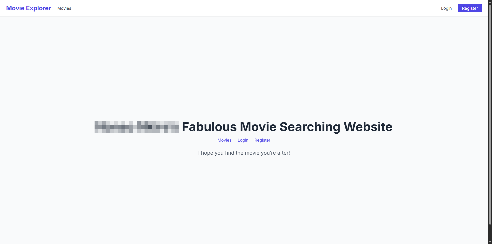
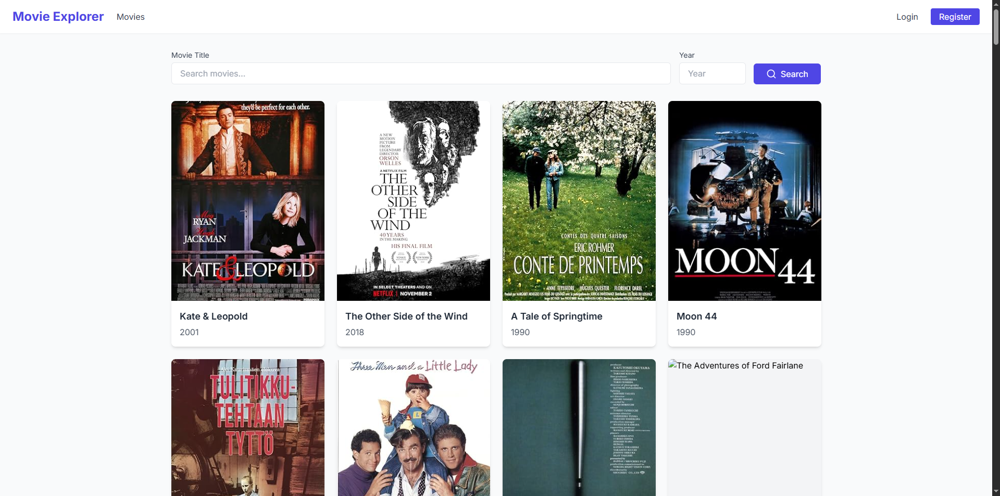
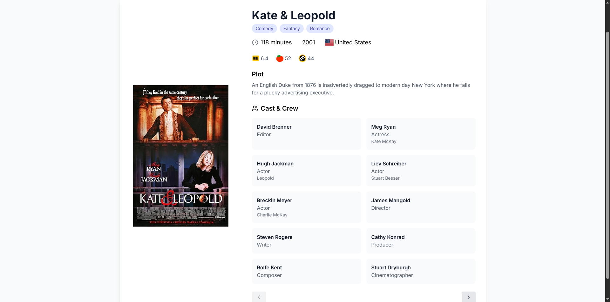
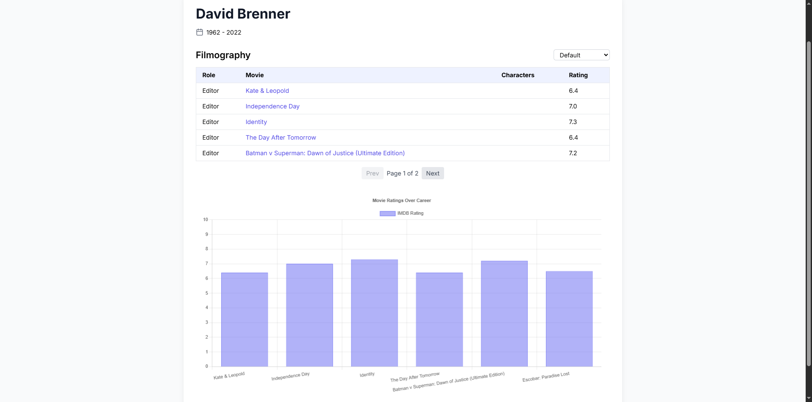

# 🎬 Movie Explorer

**Movie Explorer** is a sleek, responsive React application that lets you discover and explore movies via a rich, interactive interface. Search by title or year, browse paginated results with caching to minimize API calls, and dive into detailed pages for cast, crew, ratings, and more.

---

## 🚀 Features

- **Easy Search** by movie title and/or year  
- **Paginated Results** with “first”, “prev”, “next”, “last”, and “jump to” controls  
- **Cached Posters**: Poster images are fetched once and stored in session storage  
- **Persistent State**: Remembers last viewed page and scroll position  
- **Movie Details**: View plot, genres, runtime, countries (with flags), ratings (IMDb, Rotten Tomatoes, Metacritic), and cast & crew  
- **Auth Flow**: Register, login, protected routes, token refresh, and persisted login state via Zustand  
- **Smooth Animations**: Custom fade & pop transitions throughout  
- **Back‑to‑Top** button when you scroll toward the bottom  

---

## 🎨 Screenshots
### Home Screen

### Movies Grid  
 
### Movie Details 

### Actor Details


---

## 🛠️ Tech Stack

- **React** (CRA) & **React Router**  
- **Tailwind CSS** + custom animations  
- **Axios** with interceptor for token refresh  
- **Zustand** for lightweight global state (auth store)  
- **React Country Flag** for country icons  
- **react-hot-toast** for inline notifications  
- **Lucide‑React** for crisp SVG icons  

---

## 📦 Installation

1. **Clone** this repo  
   ```bash
   git clone https://github.com/13bad37/movie-explorer.git
   cd
